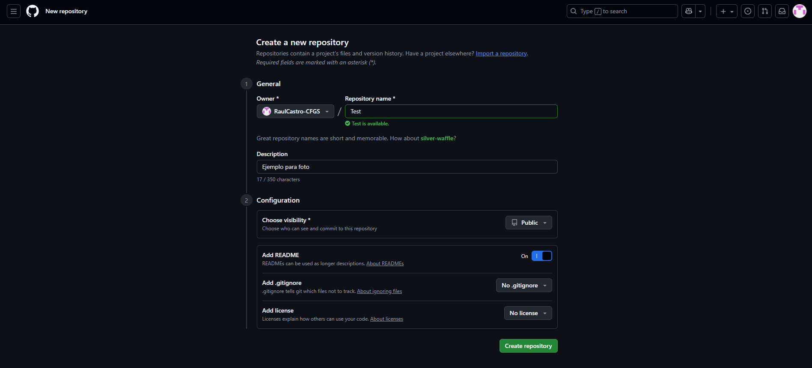

# 2526_ASIX1_0373_AE1_Apuntes
# __Bloques:__
#### 1. Cómo sincronizar VSS con github
#### 2. Introducción a Markdown
#### 3. Introducción a Html

## 1. Cómo sincronizar VSS con GitHub
Sincronizar nuestro proyecto a **GitHub** es una de las cosas que los programadores y empresas hacen para trabajar de una forma cómoda y profesional. 

Para empezar, vamos a necesitar instalar **Git** (buscar en el navegador) para poder conseguir esa sincronización entre **Visual Studio Code** y **GitHub**. Una vez instalado vamos a proceder a crear nuestro repositorio, simplemente debemos crearnos una cuenta en GitHub, ir al apartado de repositorios y crearlo, marcaremos la opción de crear un README.md activada.

Vamos a proceder a sincronizar nuestro proyecto con GitHub, para ello vamos a abrir el CMD y ejecutaremos la siguiente lista de comandos.

* **git init** -- Inicializar git (hacerlo siempre)

* **git add .** -- Añade el único archivo existente a git (README.md)

* **git commit -m "(mensaje)"** -- Explica los cambios de la nueva versión del proyecto en el repositorio

* **git push origin main** -- Manda los cambios del proyecto a GitHub

## 2. Introducción a Markdown
Podemos crear un archivo de texto plano con diferentes extensiones para archivos de Markdown dependiendo del destino del archivo.
*	.markdown
*	.md
*	.mkd
*	.mkdown
*	.text
*	.mdown

Github utiliza .md

Etiquetas básicas de Markdown:
Encabezados: Llevan ya asociados un estilo por defecto y sirven para iniciar secciones de documentos.
# H1
## H2
### H3
#### H4
##### H5
###### H6

### __Estilos de letra:__

Itálica o cursiva: Con "*" o "_" a cada banda del texto. _Ejemplo_
Negrita: Con "**" o "__" a cada banda del texto. **Ejemplo**

### Tipos de listas:
Ordenadas:
Elemento 1
Elemento 2

Desordenadas:
* Elemento desordenado 1
* Elemento desordenado 2

### Enlaces:
Es con "Link" entre [ ] y (enlace) junto a él.

### Imagenes:

### Notas al pie de página:
`[^1]`: Aquí encuentras el texto de la nota al pie de página

## 3. Introducción a Html

El **HTML (HyperText Markup Language)** es el lenguaje de marcado estándar para crear páginas web. Define la estructura y el contenido de una página. **No es un lenguaje de programación**.

---

### 3.1 Estructura y Elementos Básicos

Los elementos HTML son los bloques de construcción de las páginas web. Cada elemento está delimitado por etiquetas (ej: `body`, `head`).

* Partes del Elemento:
    * Etiqueta de apertura: Nombre del elemento entre < > (ej: `
`).
    * Etiqueta de cierre: Es igual a la de apertura, pero con una barra de cierre (/) (ej: `
`).
    * Contenido: Lo que está entre las etiquetas.
    * Elemento: Etiqueta de apertura + Contenido + Etiqueta de cierre.

#### Atributos

Contienen información adicional sobre el elemento que no aparece en el contenido visible.

* Se incluyen en la etiqueta de apertura.
* Formato: nombre="valor" (ej: class="editor-note").
* **Se recomienda**: Escribir etiquetas y atributos en minúsculas.

#### Reglas y Estructura

* Las etiquetas normalmente vienen en pares (apertura y cierre) (ej: `

`).
* Etiquetas vacías: Algunas etiquetas no tienen etiqueta de cierre ni contenido, como *img*, *br*, e *input*.
* Anidamiento: Las etiquetas deben anidarse correctamente.

* Partes de un Documento Básico: Un documento incluye **!DOCTYPE html**, **html**, y dentro de este, **head** y **body**.
    * **head**: Contiene metadatos y enlaces a estilos/scripts.
    * **body**: Contiene el contenido principal que se muestra a los usuarios.

---

### 3.2 Tipos de Elementos

Los elementos se clasifican en dos tipos:

#### Elementos de Bloque

* Se muestran como bloques independientes y separan un bloque de otro con una línea en blanco.
* **Ejemplos**: h1-h6 (encabezados), p (párrafos), br (salto de línea), div (división).

#### Elementos de Línea

* **Ejemplos**: em (énfasis/cursiva), strong (negrita/fuerte énfasis), a (hipervínculos), img, span (contenedor en línea).

#### Contenedores

* **div (Contenedor de Bloque)**: Se usa para organizar contenido o aplicar estilos con CSS.
* **span (Contenedor en Línea)**: Agrupa una pequeña parte de texto **dentro de una línea**.
* **Elementos Semánticos (HTML5)**: Describen el contenido dándole un significado correcto. Ejemplos: header, footer, article, section, nav.

---

### 3.3 Formularios y Tablas

#### Formularios (form)

Se utilizan para permitir al usuario **enviar datos a un servidor**.

| Etiqueta | Descripción | Atributos Comunes |
| :--- | :--- | :--- |
| **form** | Define un formulario. | action (URL de envío), method (POST/GET). |
| **input** | Crea diversos campos interactivos. | type (text, password, radio, checkbox, submit), id, name, value, required. |
| **select/ option** | Crea menús desplegables. | name, id, size, multiple, value. |
| **textarea** | Crea un área de texto para múltiples líneas. | name, id, rows, cols, required. |

#### Tablas (table)

Se usan para **mostrar datos en formato tabular** (filas y columnas), **NUNCA para estructurar el diseño** de la página web.

| Etiqueta | Función | Atributos para Fusionar Celdas |
| :--- | :--- | :--- |
| **table** | Define la tabla. | - |
| **tr** | Define una fila. | - |
| **th** | Celda de encabezado. | colspan (fusiona columnas), rowspan (fusiona filas). |
| **td** | Celda de datos. | colspan, rowspan. |
| **thead, tbody, tfoot** | Agrupan el encabezado, cuerpo y pie. | - |

---

### 3.4 Legibilidad y Validación

#### Legibilidad y Organización

* **Comentarios**: Anotaciones para el desarrollador, no visibles. Sintaxis: .
* **Indentación del código**.
* **Organización de archivos**: Usar directorios para CSS, imágenes, etc. El archivo de inicio debe llamarse **index.html**.

#### Validación de HTML

* Proceso de verificar que el código cumple con los **estándares** del **World Wide Web Consortium (W3C)**.
* Ayuda a detectar errores. Hemos utilizado el **validador HTML del W3C**.

